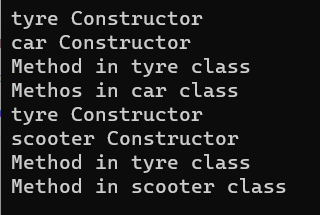

# Inheritance

## Aim:
To write a C# program to print some messages using hierarchical inheritance.
## Algorithm:
### Step 1 :
Create a base class.
### Step 2 :
Create two child class named car and scooter.
### Step 3 : 
Create a constructor in the base class and print a message.
### Step 4 :
Create a function in child class to print a message.
## Program:
```
using System;
namespace Hello
{
    public class tyre
    {
        public tyre()
        {
            Console.WriteLine("tyre Constructor");
        }
        public virtual void Display()
        {
            Console.WriteLine("Method in tyre class");
        }
    }
    public class scooter : tyre
    {
        public scooter()
        {
            Console.WriteLine("scooter Constructor");
        }

        public override void Display()
        {
            base.Display();
            Console.WriteLine("Method in scooter class");
        }
    }

    public class car : tyre
    {
        public car()
        {
            Console.WriteLine("car Constructor");
        }
        public override void Display()
        {
            base.Display();
            Console.WriteLine("Methos in car class");
        }
    }
    public class Program
    {
        public static void Main(string[] args)
        {
            car c1 = new car();
            c1.Display();
            scooter s1 = new scooter();
            s1.Display();
        }
    }
}
```
## Output:

## Result
A C# program to print some messages using hierarchical inheritance is written and executed successfully.